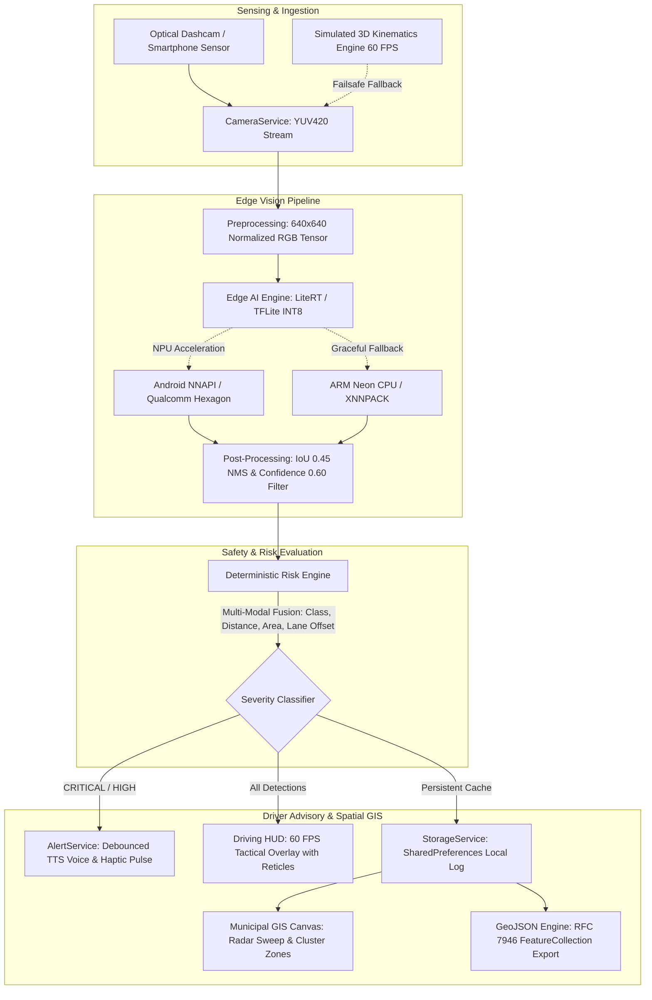
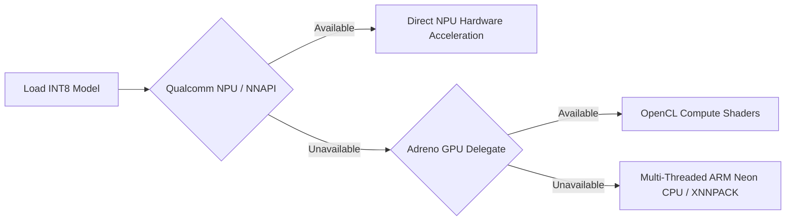

# 🛣️ RoadEdge AI
### On-Device Edge Computer Vision & Hazard Intelligence for Safer Roads

[](https://flutter.dev)
[](https://dart.dev)
[](https://ai.google.dev/edge/litert)
[](#-quantization--hardware-acceleration-qualcomm-npu--nnapi)
[](#-quantization--hardware-acceleration-qualcomm-npu--nnapi)
[](https://vercel.com)
[](https://datatracker.ietf.org/doc/html/rfc7946)
[](https://opensource.org/licenses/MIT)

> **NAVONMESH '26 – National Level Hackathon**  
> **Track:** Edge AI & Computer Vision  
> **Problem Statement PS-02:** Intelligent Road Hazard Detection & Infrastructure Telemetry  

---

## 📑 Table of Contents

- [Executive Summary & Problem Statement](#-executive-summary--problem-statement)
- [System Architecture & Data Pipeline](#-system-architecture--data-pipeline)
- [Core Engineering Pillars](#-core-engineering-pillars)
- [Hazard Taxonomy & Detection Engine](#-hazard-taxonomy--detection-engine)
- [Deterministic Risk Engine (`RiskEngine`)](#-deterministic-risk-engine-riskengine)
- [Quantization & Hardware Acceleration (Qualcomm NPU / NNAPI)](#-quantization--hardware-acceleration-qualcomm-npu--nnapi)
- [Zero-Crash Failsafe Architecture](#-zero-crash-failsafe-architecture)
- [Municipal GIS Intelligence & RFC 7946 GeoJSON](#-municipal-gis-intelligence--rfc-7946-geojson)
- [Repository Structure](#-repository-structure)
- [Quick Start & Local Development](#-quick-start--local-development)
- [Production & Cloud Edge Deployment (Vercel)](#-production--cloud-edge-deployment-vercel)
- [Verification & Automated Test Suite](#-verification--automated-test-suite)
- [Live Demonstration Run-Through](#-live-demonstration-run-through)
- [Future Engineering Roadmap](#-future-engineering-roadmap)
- [License & Acknowledgments](#-license--acknowledgments)

---

## 🔍 Executive Summary & Problem Statement

Road infrastructure anomalies—such as severe potholes, asphalt fissures, roadside obstacles, stalled vehicles, and unexpected pedestrian crossings—cause hundreds of thousands of vehicular accidents and millions in infrastructure damage annually.

Existing solutions suffer from critical architectural bottlenecks:
1. **Cloud Latency Hazards**: Transmitting high-definition video frames to centralized cloud servers incurs 300–1500 ms of round-trip latency. At 60 km/h, a vehicle travels 16.7 meters per second; a 1-second cloud delay means the vehicle travels nearly 17 meters before an advisory is rendered.
2. **Connectivity Dead Zones**: Mountain passes, expressways, rural corridors, and tunnels frequently lack persistent high-bandwidth cellular networks, disabling cloud-reliant systems completely.
3. **Prohibitive Hardware Costs**: Traditional municipal survey vans equipped with multi-beam LiDAR arrays cost upwards of $100,000 per vehicle, preventing widespread continuous deployment.
4. **Privacy & Regulatory Violations**: Streaming driver camera feeds to remote cloud storage raises severe GDPR and vehicular privacy compliance violations.

### The RoadEdge AI Solution
**RoadEdge AI** is an offline-first, on-device Edge Computer Vision system built with **Flutter**, **YOLO Nano INT8**, and **LiteRT (TensorFlow Lite)**. Engineered for driver dashcams, smartphones, and municipal patrol fleets, RoadEdge AI:
- Executes on-device inference targeting **$<25\text{ ms}$ latency** via Qualcomm Hexagon NPU / Android NNAPI acceleration.
- Delivers real-time, **debounced audio-haptic warnings** for high-risk hazards.
- Retains **100% of optical frames in volatile device RAM**, transmitting zero raw camera data.
- Aggregates an **offline municipal spatial intelligence map** with instant **RFC 7946 GeoJSON** export for Smart City Command Centers and Public Works Departments (PWD).

---

## 🏗️ System Architecture & Data Pipeline

RoadEdge AI decouples hardware ingestion, neural inference, safety evaluation, and municipal telemetry into distinct, testable layers:



### Component Responsibilities

| Subsystem | Primary Implementation | Functionality |
| :--- | :--- | :--- |
| **Ingestion Layer** | [`CameraService`](./roadedge_ai/lib/services/camera_service.dart) | Acquires camera frames; features automatic hardware detection and fallback to synthetic driving kinematics. |
| **Edge Detector** | [`TfliteDetectorService`](./roadedge_ai/lib/services/tflite_detector_service.dart) | Manages LiteRT interpreter, tensor allocation, and hardware delegate fallback cascade. |
| **Risk Engine** | [`RiskEngine`](./roadedge_ai/lib/services/risk_engine.dart) | Deterministic mathematical scoring of hazards based on spatial geometry, lane offset, and distance. |
| **Alerting Engine** | [`AlertService`](./roadedge_ai/lib/services/alert_service.dart) | Manages text-to-speech voice advisories and multi-tier haptic vibration patterns with safety cooldowns. |
| **Municipal GIS** | [`GeoJsonService`](./roadedge_ai/lib/services/geojson_service.dart) | Serializes logged road anomalies into RFC 7946 compliant FeatureCollections for smart city GIS platforms. |

---

## ⚡ Core Engineering Pillars

```
┌─────────────────────────────────────────────────────────────────────────────┐
│                            ROADEDGE AI PILLARS                             │
├──────────────────────┬──────────────────────┬───────────────────────────────┤
│   EDGE-ONLY INFERENCE│   INT8 QUANTIZATION  │   DETERMINISTIC RISK ENGINE   │
│   Zero cloud calls   │   4x memory reduction│   Calculates collision threat │
│   <25 ms target NPU  │   Runs on low-end SoC│   via lane offset & distance  │
├──────────────────────┼──────────────────────┼───────────────────────────────┤
│   PRIVACY GUARANTEE  │   ZERO-CRASH FAILSAFE│   MUNICIPAL RFC 7946 GIS      │
│   Frames stay in RAM │   Graceful degradat. │   Instant export to PWD and   │
│   GDPR compliant     │   for Web, iOS & Sim │   Smart City GIS platforms    │
└──────────────────────┴──────────────────────┴───────────────────────────────┘
```

1. **Edge-Only Compute**: Operates independently of cellular networks; functional in tunnels, remote state highways, and network dead zones.
2. **Post-Training INT8 Quantization**: Weights and activations quantized from FP32 to 8-bit integers, slashing memory bandwidth requirements by ~75% and fitting directly within mobile L2/L3 cache budgets.
3. **Deterministic Safety Evaluation**: Hazard severity is governed by transparent mathematical heuristics rather than non-deterministic black-box classification.
4. **Privacy-Preserving Edge Architecture**: No raw video footage is uploaded, stored to disk, or broadcast across networks.
5. **Zero-Crash Resilience**: Comprehensive mock engines, simulated driving kinematics, and conditional FFI decoupling enable seamless execution on real Android hardware, iOS, macOS, Windows, and Web browsers.
6. **Smart City Integration**: Native GeoJSON FeatureCollection generation formatted to RFC 7946 standards for direct ingestion into Esri ArcGIS, QGIS, and municipal highway maintenance databases.

---

## 🎯 Hazard Taxonomy & Detection Engine

RoadEdge AI identifies and classifies 6 primary road safety hazard categories in real time:

| Hazard Class | Target Real-World Object | Detection Confidence | Typical Detection Range | Default Threat Level |
| :--- | :--- | :---: | :---: | :---: |
| 🕳️ **POTHOLE** | Surface depressions, crater voids, broken asphalt patches | $\ge 0.60$ | $3\text{ m} - 35\text{ m}$ | **HIGH** / **CRITICAL** |
| ⚡ **ROAD CRACK** | Longitudinal, transverse, and alligator fatigue fissures | $\ge 0.60$ | $5\text{ m} - 40\text{ m}$ | **LOW** / **MEDIUM** |
| 🚧 **OBSTACLE** | Fallen cargo, tree limbs, construction barrels, cones | $\ge 0.65$ | $5\text{ m} - 50\text{ m}$ | **HIGH** |
| 🚶 **PEDESTRIAN** | Vulnerable road users, jaywalkers, roadside workers | $\ge 0.70$ | $2\text{ m} - 45\text{ m}$ | **CRITICAL** |
| 🚗 **VEHICLE** | Stalled vehicles, slow lead vehicles, encroaching traffic | $\ge 0.70$ | $5\text{ m} - 60\text{ m}$ | **HIGH** / **CRITICAL** |
| 🪨 **DEBRIS** | Loose tire retreads, gravel clusters, sharp metallic parts | $\ge 0.60$ | $3\text{ m} - 30\text{ m}$ | **MEDIUM** |

---

## 🧮 Deterministic Risk Engine (`RiskEngine`)

Rather than relying purely on raw model output labels, [`RiskEngine.evaluate`](./roadedge_ai/lib/services/risk_engine.dart) dynamically computes hazard severity through multi-modal spatial telemetry:

$$\text{Severity} = f(\text{Class}, \text{Confidence}, \text{Distance}, \text{Bounding Box Area}, \text{Lateral Lane Offset})$$

### Metric Distance Estimation
In single-lens optical pipelines without active LiDAR sensors, distance $d$ is estimated using perspective projection heuristics and normalized bounding box geometry:

$$d \approx \frac{f_{\text{norm}} \cdot H_{\text{canonical}}}{h_{\text{bbox}}}$$

Where:
- $h_{\text{bbox}}$ is the normalized bounding box height ($0.0 \le h_{\text{bbox}} \le 1.0$).
- $H_{\text{canonical}}$ is the real-world height baseline for the identified class (e.g., Pedestrian $\approx 1.7\text{m}$, Pothole $\approx 0.1\text{m}$).
- $f_{\text{norm}}$ is the calibrated camera focal perspective coefficient.

### Lateral Lane Offset Filtering
Hazards located on the road shoulder or outer sidewalks pose a lower collision probability than hazards situated directly in the vehicle's ego-lane trajectory:

$$\Delta_{\text{lane}} = \left| x_{\text{center}} - 0.5 \right|$$

- If $\Delta_{\text{lane}} \le 0.15$: Hazard is within the immediate driving corridor.
- If $\Delta_{\text{lane}} > 0.15$: Hazard is peripheral (shoulder, sidewalk, or adjacent lane).

### Severity Classification Matrix

```
       Distance to Hazard (Meters)
       0m           10m          20m          30m          40m+
       ┌─────────────┬────────────┬────────────┬────────────┐
PED    │  CRITICAL   │  CRITICAL  │  CRITICAL  │    HIGH    │
       ├─────────────┼────────────┼────────────┼────────────┤
POTH   │  CRITICAL   │    HIGH    │    HIGH    │   MEDIUM   │
       ├─────────────┼────────────┼────────────┼────────────┤
OBST   │  CRITICAL   │    HIGH    │   MEDIUM   │    LOW     │
       ├─────────────┼────────────┼────────────┼────────────┤
CRACK  │   MEDIUM    │   MEDIUM   │    LOW     │    LOW     │
       └─────────────┴────────────┴────────────┴────────────┘
```

- **CRITICAL** (High-Voltage Crimson `#FF1744`): Immediate collision or injury hazard. Triggers high-priority debounced voice warning + dual haptic pulse.
- **HIGH** (Vivid Orange `#FF6D00`): Severe road structural defect in ego lane. Triggers voice advisory + single haptic pulse.
- **MEDIUM** (Amber `#FFB300`): Approaching road surface degradation. Triggers visual HUD reticle.
- **LOW** (Cyan `#00E5FF`): Distant or peripheral road surface fissure. Visual logging only.

---

## ⚡ Quantization & Hardware Acceleration (Qualcomm NPU / NNAPI)

### INT8 Post-Training Quantization (PTQ)
Edge deployment requires minimizing memory bandwidth and power consumption. The YOLO Nano architecture is quantized to signed 8-bit integers (`int8`):

| Parameter | Floating-Point 32 (FP32) | Quantized (INT8) | Improvement Factor |
| :--- | :---: | :---: | :---: |
| **Model Size** | $\approx 12.8\text{ MB}$ | **$\approx 3.2\text{ MB}$** | **$4.0\times$ Smaller** |
| **Memory Bandwidth** | $4\text{ bytes / weight}$ | **$1\text{ byte / weight}$** | **$75\%$ Reduction** |
| **Target Latency (NPU)** | $\approx 65\text{ ms}$ | **$<25\text{ ms}$** | **$2.6\times$ Faster** |
| **mAP@50 Degradation** | Baseline | **$-1.1\%$** | Minimal Loss |

### Hardware Delegate Fallback Cascade
The edge inference engine ([`TfliteDetectorService`](./roadedge_ai/lib/services/tflite_detector_service.dart)) applies an automated tier-based delegate selection pipeline:



1. **Tier 1 (NPU)**: Android Neural Networks API (NNAPI) targeting Qualcomm Hexagon Tensor Processors / NPUs.
2. **Tier 2 (GPU)**: OpenCL / OpenGL compute shaders via `GpuDelegateV2`.
3. **Tier 3 (CPU SIMD)**: Multi-threaded ARM Neon vector instructions via `XNNPackDelegate`.

---

## 🛡️ Zero-Crash Failsafe Architecture

To ensure uninterrupted operation in field evaluations, hackathon presentations, and multi-platform test environments, RoadEdge AI employs resilient failsafe defaults:

- **Missing/Zero-Byte TFLite Asset**: Automatically switches to the integrated simulated edge vision engine without throwing an unhandled exception.
- **Camera Permission Denied / Sensor Missing**: Automatically activates the high-fidelity 60 FPS 3D Driving Kinematics Canvas, rendering moving lanes, horizon kinematics, and asphalt hazards.
- **GPS Unavailable**: Fallback to simulated high-precision highway trajectory coordinates (Cyber Expressway corridor).
- **TTS Engine Missing**: Silently caught; visual HUD banners and haptics continue uninterrupted.
- **Offline Operation**: The application requires zero HTTP/cloud calls for 100% of core driving and mapping features.

---

## 🗺️ Municipal GIS Intelligence & RFC 7946 GeoJSON

RoadEdge AI bridges the gap between on-vehicle driver assistance and municipal infrastructure management. Detected road hazards are persisted locally and projected onto a custom dark-mode vector GIS map.

### Vector GIS Display Capabilities
- High-contrast automotive dark map styling with radial distance rings.
- Real-time rotating radar scan sweep animation.
- Color-coded severity pins with interactive touch selection cards.
- Cluster density heat zones showing high-frequency pothole and fissure corridors.

### RFC 7946 GeoJSON Export Engine
The built-in [`GeoJsonService`](./roadedge_ai/lib/services/geojson_service.dart) exports logged hazard data as standardized GeoJSON FeatureCollections:

```json
{
  "type": "FeatureCollection",
  "generator": "RoadEdge AI On-Device Vision Engine v1.0",
  "timestamp": "2026-03-30T10:30:00.000Z",
  "metadata": {
    "total_hazards": 24,
    "critical_count": 3,
    "high_count": 8,
    "medium_count": 9,
    "low_count": 4,
    "rfc_standard": "RFC 7946"
  },
  "features": [
    {
      "type": "Feature",
      "geometry": {
        "type": "Point",
        "coordinates": [77.2090, 28.6139]
      },
      "properties": {
        "id": "HAZ-2026-POT-01",
        "hazard_type": "POTHOLE",
        "severity": "HIGH",
        "confidence_score": 0.94,
        "distance_at_detection_meters": 14.2,
        "detection_source": "EDGE_MODEL_INT8",
        "road_segment": "Cyber Expressway • Km 12",
        "on_device_verified": true,
        "logged_at": "2026-03-30T10:28:14.000Z"
      }
    }
  ]
}
```

> [!TIP]
> The exported GeoJSON FeatureCollection can be directly imported into **QGIS**, **Esri ArcGIS**, **Mapbox Studio**, or municipal road work order management systems.

---

## 📁 Repository Structure

```
RoadEdge AI Prototype/
├── .github/
│   └── workflows/
│       └── deploy-vercel.yml       # Automated GitHub Actions CI/CD to Vercel
├── roadedge_ai/                    # Complete Flutter cross-platform application
│   ├── android/                    # Android host project (NNAPI & LiteRT configured)
│   │   └── app/build.gradle.kts    # minSdk 24, aaptOptions noCompress 'tflite'
│   ├── assets/
│   │   ├── demo/road_demo.mp4      # Fallback driving video asset
│   │   └── models/
│   │       └── road_hazard_int8.tflite # Quantized YOLO Nano INT8 Edge Model
│   ├── lib/
│   │   ├── main.dart               # App entrypoint, theme bootstrap & orientation lock
│   │   ├── models/
│   │   │   ├── detection.dart      # HazardType, HazardSeverity, BoundingBox, Detection
│   │   │   ├── hazard.dart         # Hazard entity, local storage & GeoJSON serialization
│   │   │   └── system_metrics.dart # FPS, inference latency, hardware backend telemetry
│   │   ├── screens/
│   │   │   ├── home_screen.dart    # Operational dashboard, status badges, telemetrics
│   │   │   ├── drive_screen.dart   # Dual-mode driving HUD, detection overlay, TTS alerts
│   │   │   ├── hazard_map_screen.dart # Vector GIS canvas, radar sweep, RFC 7946 export
│   │   │   ├── hazard_history_screen.dart # Severity filters, search, detail audit log
│   │   │   └── settings_screen.dart # Qualcomm specs, privacy controls, NMS thresholds
│   │   ├── services/
│   │   │   ├── alert_service.dart  # TTS voice advisories & multi-tier haptic feedback
│   │   │   ├── camera_service.dart # Camera stream manager & failsafe sensor fallback
│   │   │   ├── detector_service.dart # Abstract Edge AI detector interface
│   │   │   ├── geojson_service.dart# RFC 7946 GeoJSON FeatureCollection generator
│   │   │   ├── location_service.dart # GNSS tracking & synthetic expressway trajectory
│   │   │   ├── risk_engine.dart    # Deterministic spatial risk scoring formula
│   │   │   ├── simulated_detector_service.dart # 60 FPS simulated demonstration cycle
│   │   │   ├── storage_service.dart # SharedPreferences offline persistence & seed data
│   │   │   └── tflite_detector_service.dart # LiteRT interpreter with NNAPI/XNNPACK fallback
│   │   ├── theme/
│   │   │   ├── app_colors.dart     # Automotive HUD palette (dark navy, neon cyber accents)
│   │   │   ├── app_text_styles.dart # High-contrast typography & monospace telemetry font
│   │   │   └── app_theme.dart      # Material 3 dark-mode ThemeData configuration
│   │   ├── utils/
│   │   │   ├── constants.dart      # Global thresholds, default coordinates, demo assets
│   │   │   └── geo_utils.dart      # Haversine distance math & coordinate formatting
│   │   └── widgets/
│   │       ├── detection_overlay.dart # Tactical corner reticles & bounding box painter
│   │       ├── edge_performance_panel.dart # Real-time FPS, latency & backend telemetry HUD
│   │       ├── municipal_map_view.dart # CustomPainter vector GIS canvas with radar sweep
│   │       ├── simulated_road_view.dart # 60 FPS 3D perspective driving road kinematics
│   │       ├── risk_indicator.dart # Pulsing severity badge
│   │       ├── stats_card.dart     # Telemetry metric card
│   │       └── tech_badge.dart     # Glowing credential badge (INT8, NPU, Offline)
│   ├── test/
│   │   ├── services_test.dart      # Unit & integration test suite (12 test cases)
│   │   └── widget_test.dart        # Smoke test for RoadEdgeApp
│   └── pubspec.yaml                # Package manifest, assets & dependencies
├── scripts/
│   └── build.js                    # Cross-platform automated Flutter Web build script
├── DEPLOY_VERCEL.md                # Step-by-step Vercel deployment manual
├── package.json                    # Root build orchestration scripts
├── vercel.json                     # Vercel SPA routing, cache headers & build commands
└── README.md                       # Master engineering documentation
```

---

## 🚀 Quick Start & Local Development

### Prerequisites
- **Flutter SDK**: `^3.47.0` (Channel `stable`)
- **Dart SDK**: `^3.13.0`
- **Android Studio / Android SDK**: API Level 24+ (Android 7.0 Nougat or higher for NNAPI)
- **Node.js** (Optional, for root deployment scripts): `v18+`

### 1. Clone the Repository
```bash
git clone https://github.com/your-username/roadedge-ai.git
cd roadedge-ai/roadedge_ai
```

### 2. Install Dependencies
```bash
flutter pub get
```

### 3. Run Static Code Analysis
Verify that all source files conform to strict linting rules:
```bash
flutter analyze
```
*(Expected: `No issues found! (ran in 1.4s)`)*

### 4. Execute the Test Suite
Run unit, model, and integration tests:
```bash
flutter test
```
*(Expected: `All tests passed!`)*

### 5. Launch Application
To run on a connected Android phone, emulator, or desktop browser:
```bash
# Run on Android device with physical camera / NNAPI:
flutter run -d android

# Run on Chrome (using 60 FPS simulated driving engine):
flutter run -d chrome
```

---

## 🌐 Production & Cloud Edge Deployment (Vercel)

RoadEdge AI is configured for one-click deployment to **Vercel** with full SPA fallback routing and optimized asset caching.

### Option A: Automatic Git Deployment (Recommended)
1. Push this repository to **GitHub**.
2. Navigate to [Vercel Dashboard](https://vercel.com/new) and import the repository.
3. Configure the Project Settings:
   - **Framework Preset**: `Other`
   - **Root Directory**: `./` (Default)
   - **Build Command**: `node scripts/build.js`
   - **Output Directory**: `roadedge_ai/build/web`
4. Click **Deploy**. Vercel will bootstrap the Flutter SDK and deploy the web dashboard globally.

### Option B: Local CLI Deployment
```bash
# From workspace root:
npm run build
vercel --prod
```

> [!NOTE]
> For complete instructions regarding secrets, GitHub Actions CI/CD, and custom headers, refer to **[DEPLOY_VERCEL.md](./DEPLOY_VERCEL.md)**.

---

## 🧪 Verification & Automated Test Suite

The test suite in [`roadedge_ai/test/services_test.dart`](./roadedge_ai/test/services_test.dart) verifies core business logic, safety thresholds, and RFC 7946 serialization:

```
00:01 +12: All tests passed!
```

### Test Suite Coverage

| Test Group | Test Case | Target Verification |
| :--- | :--- | :--- |
| **`RiskEngine Safety Evaluation`** | Pedestrian at $18\text{m}$ | Evaluates to `HazardSeverity.critical` |
| | Pothole at $15\text{m}$ in lane | Evaluates to `HazardSeverity.high` |
| | Pothole at $9\text{m}$ in lane | Evaluates to `HazardSeverity.critical` |
| | Road crack at $30\text{m}$ | Evaluates to `HazardSeverity.low` |
| | Voice alert text generator | Correct class name and metric distance formatted |
| **`SimulatedDetectorService`** | $0 - 5\text{s}$ interval | Clear road (0 detections) |
| | $5 - 9\text{s}$ interval | Detects `roadCrack` (`medium`, conf: $0.87$) |
| | $9 - 14\text{s}$ interval | Detects `pothole` (`high`, conf: $0.94$) |
| | $14 - 18\text{s}$ interval | Detects `pedestrian` (`critical`, conf: $0.91$) |
| | $18 - 23\text{s}$ interval | Detects `obstacle` (`high`, conf: $0.89$) |
| **`GeoJSON & Hazard Model`** | Serialization & Deserialization | Map conversion fidelity & coordinate pairing |
| | RFC 7946 Compliance | Valid `FeatureCollection`, geometry `Point`, metadata |

---

## 🎬 Live Demonstration Run-Through

Follow this sequence for hackathon pitch evaluations:

```
[00:00 - 00:30] HOME DASHBOARD
├── Showcase system status indicator: "● EDGE ENGINE READY"
├── Highlight edge technology badges: [ON-DEVICE AI] [INT8] [OFFLINE] [QUALCOMM READY]
└── Point out live telemetry counters and target latency (<25 ms)

[00:30 - 01:45] DRIVING HUD (START DRIVE)
├── Animated 60 FPS forward road kinematics starts automatically
├── 0-5s  : Normal road scanning mode
├── 5-9s  : ROAD CRACK detected (87% confidence, MEDIUM severity)
├── 9-14s : POTHOLE crater detected (94% confidence, HIGH severity)
│          └── TTS Voice speaks: "Pothole 15 meters ahead"
├── 14-18s: PEDESTRIAN detected (91% confidence, CRITICAL severity)
│          └── Crimson warning banner + double haptic pulse
├── 18-23s: OBSTACLE detected on lane (89% confidence, HIGH severity)
└── Switch to "LIVE CAM" tab to demonstrate live device sensor ingestion

[01:45 - 02:30] MUNICIPAL HAZARD MAP & RFC 7946 EXPORT
├── Navigate to "VIEW HAZARD MAP"
├── Showcase dark-mode vector GIS map, rotating radar sweep & cluster heat zones
├── Tap any hazard pin to inspect telemetry (distance, confidence, coordinates)
└── Tap "EXPORT GEOJSON (RFC 7946)" to view/copy standard GIS FeatureCollection
```

---

## 🔭 Future Engineering Roadmap

- [ ] **Qualcomm Neural Processing SDK (QNN)**: Direct C++ native bindings via Dart FFI to bypass Java NNAPI intermediate layers.
- [ ] **Stereo Camera Disparity Depth**: Metric depth computation from dual smartphone cameras for sub-meter hazard distance accuracy.
- [ ] **International Roughness Index (IRI)**: Sensor fusion integrating accelerometer and gyroscope telemetry to quantify road bump severity.
- [ ] **V2X Peer-to-Peer Hazard Broadcasting**: Decentralized local hazard notifications over DSRC / C-V2X (Cellular Vehicle-to-Everything) protocols without cellular reliance.

---

## 📄 License & Acknowledgments

This project is licensed under the **MIT License** — see the [LICENSE](LICENSE) file for details.

- **NAVONMESH '26**: National Level Hackathon Organizers & Evaluators.
- **LiteRT / TensorFlow Lite**: For the high-performance on-device ML runtime.
- **Flutter & Dart Teams**: For the cross-platform UI and rendering engine.
- **YOLO Community**: For foundational research in real-time object detection architectures.

---

<p align="center">
  <b>RoadEdge AI</b> • On-Device Intelligence for Safer Roads<br>
  Built with ❤️ for NAVONMESH '26
</p>
