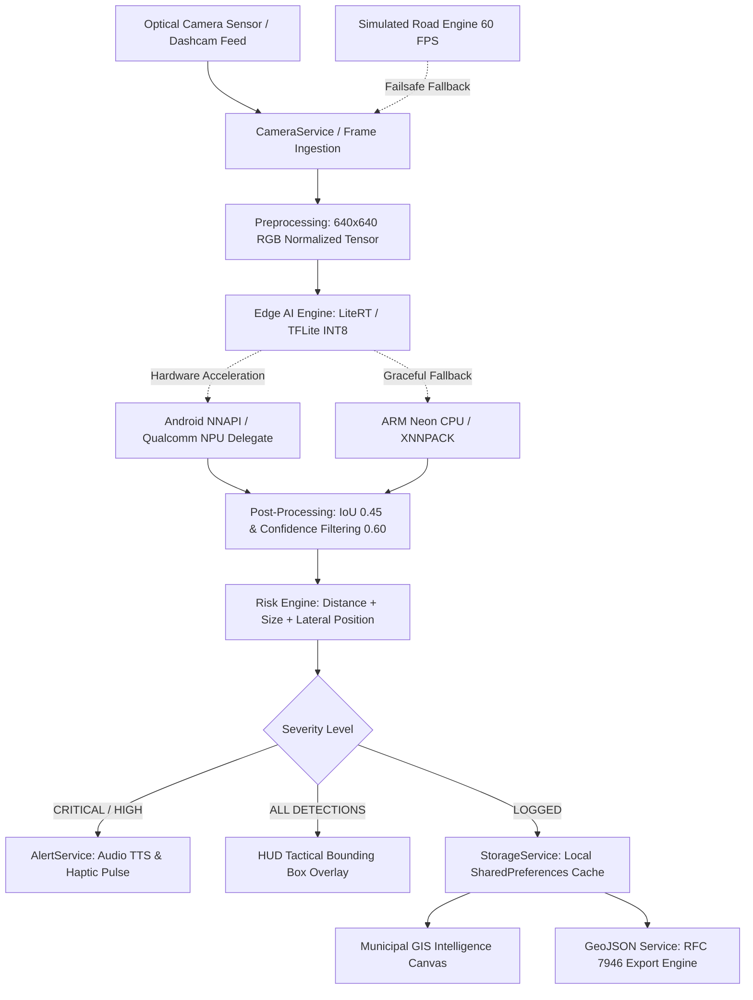

# RoadEdge AI
### On-Device Intelligence for Safer Roads
**NAVONMESH '26 – National Level Hackathon**  
**Track:** Edge AI & Computer Vision  
**Problem Statement PS-02:** Intelligent Road Hazard Detection  

---

## 1. Executive Summary & Problem Statement
Poor road infrastructure, unexpected obstacles, deep potholes, and sudden pedestrian crossings pose severe threats to vehicular safety and urban mobility. Conventional road monitoring approaches rely on manual surveys or delayed cloud-based citizen reporting apps that are ineffective for real-time driver warnings and fail in network dead zones (tunnels, rural highways, remote corridors).

**RoadEdge AI** is a real-time, on-device edge computer vision system built with **Flutter**, **YOLO Nano INT8**, and **LiteRT/TFLite**. Designed for automotive dashcams, driver smartphones, and municipal patrol fleets, RoadEdge AI detects potholes, road cracks, obstacles, pedestrians, vehicles, and debris in real time, delivering sub-second audio-haptic warnings to drivers while building an offline-first municipal hazard intelligence map.

---

## 2. Key Architectural Pillars

| Pillar | Implementation | Technical Advantage |
| :--- | :--- | :--- |
| **Edge-Only Inference** | YOLOv8n / YOLO11n Nano INT8 via LiteRT | Zero cloud round-trip delay; operates in tunnels & remote highways |
| **Quantization** | INT8 Post-Training Quantization (PTQ) | ~4x memory footprint reduction; enables mobile real-time inference |
| **Hardware Acceleration** | Android NNAPI / Qualcomm Hexagon NPU compatible | High compute efficiency; graceful fallback to ARM Neon SIMD |
| **Privacy First** | Zero frame transmission | Camera feed stays in volatile memory on-device; GDPR/privacy compliant |
| **Deterministic Risk Engine** | Distance + Area + Lateral lane offset heuristics | Differentiates shoulder debris from collision-critical lane hazards |
| **Municipal Intelligence** | RFC 7946 GeoJSON Export | Seamless ingestion into Smart City GIS, PWD, and Highway Authority systems |

---

## 3. High-Level System Architecture



---

## 4. Supported Hazard Classes & Detection Pipeline

RoadEdge AI classifies 6 road safety hazard categories:

1. **POTHOLE**: Surface depressions, crater voids, broken asphalt patches.
2. **ROAD CRACK**: Longitudinal, transverse, and alligator surface fissures.
3. **OBSTACLE**: Road debris, fallen tree branches, construction barriers, traffic cones.
4. **PEDESTRIAN**: Vulnerable road users, jaywalkers, road workers.
5. **VEHICLE**: Stalled or slow-moving lead vehicles in immediate lane.
6. **DEBRIS**: Loose tire fragments, gravel clusters, sharp objects.

### Risk Engine Logic (`RiskEngine.evaluate`)
Severity is calculated dynamically from multi-modal variables:
$$\text{Severity} = f(\text{Class}, \text{Confidence}, \text{Distance}, \text{Bounding Box Area}, \text{Lateral Lane Offset})$$

- **CRITICAL**: Pedestrian $\le 25\text{m}$, or pothole $\le 12\text{m}$ in driving lane, or vehicle $\le 8\text{m}$.
- **HIGH**: Pothole $\le 22\text{m}$ with confidence $\ge 0.75$, obstacle $\le 25\text{m}$.
- **MEDIUM**: Road cracks $\le 25\text{m}$, debris in outer lane, distant obstacles.
- **LOW**: Distant surface cracks ($>25\text{m}$), minor roadside artifacts.

---

## 5. Technology Stack & Packages

- **Framework**: Flutter 3.47+ / Dart 3.13+
- **Inference Runtime**: `tflite_flutter` (LiteRT / TensorFlow Lite C API)
- **Computer Vision Model**: YOLOv8n / YOLO11n Nano INT8 Quantized (640x640)
- **Sensors & Optical Pipeline**: `camera` package (YUV420 frame streaming)
- **Geospatial & Telemetry**: `geolocator` (GNSS coordinates with simulated highway trajectory fallback)
- **Driver Advisories**: `flutter_tts` (Text-to-Speech) + `package:flutter/services.dart` (`HapticFeedback`)
- **Persistence**: `shared_preferences` (offline local JSON serialization)
- **Formatting**: `intl` (date/time telemetrics)

---

## 6. Qualcomm Acceleration & Edge Optimization Strategy

### Hardware Acceleration Compatibility
The edge detector is designed for Android Neural Networks API (NNAPI) and Qualcomm Hexagon NPU architectures:
1. **Model Quantization**: Fully quantized INT8 weights and activations reduce memory bandwidth by 75% compared to FP32, fitting comfortably within mobile L2/L3 cache budgets.
2. **Delegate Pipeline**:
   - Primary: Android NNAPI / Qualcomm Hexagon Tensor Processor target.
   - Secondary: GPU Delegate (`GpuDelegateV2`) for Adreno OpenCL compute.
   - Tertiary: ARM Neon multi-threaded CPU SIMD (`XNNPackDelegate`).
3. **No Unhandled Crashes**: If specialized NPU delegates are absent on the host platform, the runtime seamlessly falls back without application interruption.
4. **Target Inference Latency**: Designed for target inference latency $<25\text{ ms}$ on modern Qualcomm Snapdragon edge platforms. *(Values explicitly labeled as target/design metrics until physical on-device profiling).*

---

## 7. Failsafe Architecture (Zero Crash Guarantee)

To guarantee flawless hackathon demonstrations even in adverse network, camera, or simulator conditions:
- **Missing or 0-byte TFLite Model**: Automatically falls back to high-fidelity simulated edge inference.
- **Camera Permission Denied or Absent Sensor**: Automatically defaults to the animated 60 FPS 3D Driving Scene.
- **GPS Unavailable or Disabled**: Switches automatically to a simulated smart highway driving trajectory.
- **TTS Engine Missing**: Gracefully caught; haptic and visual alert banners continue operating.
- **Offline Environment**: Zero HTTP requests required for core functionality.

---

## 8. Screen Directory & User Flow

1. **Home Dashboard (`HomeScreen`)**:
   - Status badge: `● EDGE ENGINE READY`
   - Real-time statistics: Hazards detected today, High risk hazards, Avg confidence, Target latency.
   - Credential badges: `ON-DEVICE AI`, `INT8`, `OFFLINE`, `PRIVACY FIRST`, `QUALCOMM READY`.
   - CTAs: `START DRIVE` and `VIEW HAZARD MAP`.

2. **Driving HUD (`DriveScreen`)**:
   - Dual-mode toggle: `LIVE CAMERA` vs `SIMULATED DRIVE`.
   - 60 FPS forward road perspective canvas with moving lane dividers and asphalt kinematics.
   - Bounding boxes with tactical corner reticles, class tags, confidence %, and distance tags.
   - Dynamic alert banner: e.g., *"HAZARD DETECTED: Pothole • 15m ahead • HIGH RISK"*.
   - Debounced audio advisory (TTS) and haptic vibration feedback.
   - Bottom quick-trigger chips for manual hazard demonstration.
   - Real-time Edge Performance HUD (FPS, Target latency, Network state, Model quantization).

3. **Hazard History (`HazardHistoryScreen`)**:
   - Filter by severity: `ALL`, `CRITICAL`, `HIGH`, `MEDIUM`, `LOW`.
   - Full-text search by hazard class and road segment.
   - Detailed inspection dialog with GNSS coordinates and detection metadata.
   - Reset sample dataset button for recurring presentations.

4. **Municipal Intelligence Screen (`HazardMapScreen`)**:
   - Offline dark-mode vector GIS map canvas with road network and radial ring corridors.
   - Rotating radar scan sweep effect.
   - Interactive color-coded severity pins and cluster density heat zones.
   - Interactive pin selection with metadata popup card.
   - `EXPORT GEOJSON (RFC 7946)` button: copies and displays valid GIS FeatureCollection.

5. **Model Information & Settings (`SettingsScreen`)**:
   - Complete technical breakdown of YOLOv8n INT8, 640x640 input shape, and LiteRT runtime.
   - Edge vs Cloud comparative matrix.
   - Privacy guarantees card (Zero frames uploaded, pure local storage).
   - Adjustable Confidence and NMS IoU threshold sliders.
   - Voice alert toggle switch.

---

## 9. Hackathon Demo Sequence (Pitch Script)

1. **Home Screen**:
   - Highlight the **System Status**: `● EDGE ENGINE READY`.
   - Point out the **Technology Badges**: `ON-DEVICE AI`, `INT8`, `OFFLINE`, `PRIVACY FIRST`, `QUALCOMM READY`.
2. **Start Drive (HUD)**:
   - Tap **START DRIVE**. The animated 3D driving scene begins immediately with road lane motion at 60 FPS.
   - Point out the dashcam telemetry: Speed (48 km/h), GPS coordinates, and REC watermark.
3. **Simulated Detection Progression**:
   - **0-5s**: Scanning clear road.
   - **5-9s**: `ROAD CRACK` appears on asphalt (87% confidence, MEDIUM severity).
   - **9-14s**: `POTHOLE` crater approaches (94% confidence, HIGH severity) $\rightarrow$ Audio alert speaks: *"Pothole 15 meters ahead"*.
   - **14-18s**: `PEDESTRIAN` approaches roadside (91% confidence, CRITICAL severity) $\rightarrow$ High-voltage crimson banner & double haptic pulse.
   - **18-23s**: `OBSTACLE` detected on lane (89% confidence, HIGH severity).
4. **Live Camera Demonstration**:
   - Tap **LIVE CAM** tab on top HUD bar to showcase device camera feed with detection overlay.
5. **Municipal Intelligence & Export**:
   - Tap back, navigate to **VIEW HAZARD MAP**.
   - Show the offline vector GIS map with radar scan, hazard pins, and severity density zones.
   - Tap on a pin to display its telemetry inspector.
   - Tap **EXPORT GEOJSON (RFC 7946)** $\rightarrow$ Show the formatted GeoJSON FeatureCollection ready for Smart City integration.

---

## 10. Future Roadmap

- [ ] **Qualcomm Neural Processing SDK (QNN)** direct C++ native bindings via Dart FFI.
- [ ] **Stereo Camera Depth Estimation**: Direct metric distance estimation from dual mobile lenses.
- [ ] **Road Roughness Index (IRI)**: Accelerometer and gyroscope fusion for bump severity quantification.
- [ ] **V2X (Vehicle-to-Everything)**: Local peer-to-peer hazard broadcast over DSRC / C-V2X without cellular reliance.

---

## 11. How to Run

```bash
# 1. Navigate to project directory
cd roadedge_ai

# 2. Get dependencies
flutter pub get

# 3. Analyze codebase (0 errors / 0 warnings)
flutter analyze

# 4. Run test suite (12 tests)
flutter test

# 5. Run on connected device or emulator
flutter run
```
